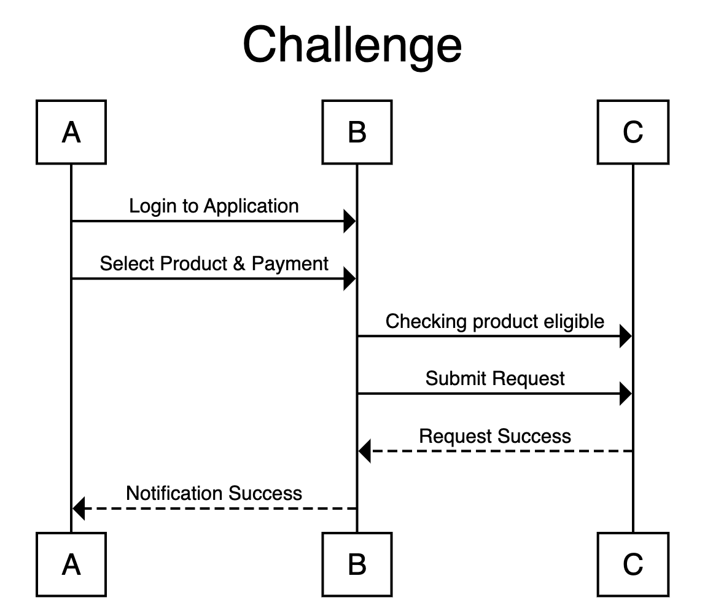

# Sequence Diagram

A tool for creating sequence diagrams for end to end daily activities.

### Simple Usage



```
title Challenge

begin A, B, C 

A -> B : Login to Application
A -> B : Select Product & Payment
B -> C : Checking product eligible
B -> C : Submit Request
C --> B : Request Success
B --> A : Notification Success

terminators box
```

## Contributing

Contributions are welcome!

Library Sequence Diagram : [Github Reference](https://github.com/davidje13/SequenceDiagram/issues)

SharePoint API : [SharePoint Reference](https://docs.microsoft.com/en-us/graph/api/driveitem-put-content?view=graph-rest-1.0&tabs=http) & [SharePoint Reference Internal SA](https://gitlab.com/AwesomeRei/sharepoint)

For more details on contributing, see the
[CONTRIBUTING.md file](docs/CONTRIBUTING.md).
